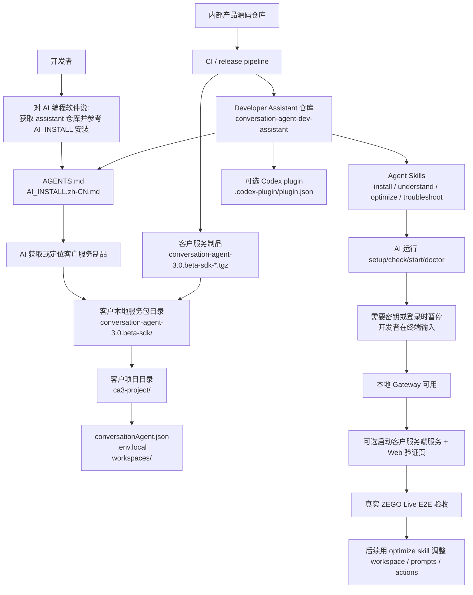

# Conversation Agent Developer Assistant

Conversation Agent Developer Assistant 是面向 AI 编程软件的开发者辅助仓库，用于帮助开发者安装、理解、配置、调优和排障 Conversation Agent Service。

它不是 Conversation Agent Service runtime，也不包含闭源服务源码或客户密钥。客户运行服务时使用客户服务制品；AI 编程软件理解和操作服务时使用本仓库。

## 仓库和制品关系

| 类型 | 开发者是否直接使用 | 职责 |
| --- | --- | --- |
| 内部产品源码仓库 | 否 | 研发、打包、发布、Live E2E、生成客户制品。 |
| 客户服务制品 | 是 | 可运行 Conversation Agent Service、workspace、setup/check/doctor、客户服务端服务示例、Web 验证页。 |
| Developer Assistant 仓库 | 是 | 面向 Codex / Cursor / Claude Code 等 AI 编程软件的安装引导、AGENTS.md、skills/plugin、调优流程和排障流程。 |

## 开发者路径



## 给 AI 编程软件的启动提示

```text
帮我获取 https://github.com/zego/conversation-agent-dev-assistant，
阅读 AI_INSTALL.zh-CN.md 和 AGENTS.md，
按里面的步骤安装 Conversation Agent Service。
遇到 GitHub、ZEGO、LLM、npm registry 等鉴权或密钥输入时，
不要让我在聊天里粘贴密钥，请让我在本地终端自己输入。
完成后运行 check/status/doctor，并说明当前达到哪一级验收。
```

## 可用 Skills

| Skill | 用途 |
| --- | --- |
| `conversation-agent-install` | 引导下载或定位客户服务制品，初始化项目，运行 setup/check/start/doctor。 |
| `conversation-agent-understand-service` | 解释 Conversation Agent Service 的边界、配置、客户服务端服务和 Web 示例关系。 |
| `conversation-agent-optimize-prompts` | 调整客户 workspace、mode prompt、knowledge、action contract，并设计验证。 |
| `conversation-agent-troubleshoot-live-e2e` | 排查安装、Gateway、客户服务端服务、Web、ZEGO Live E2E 问题。 |

`skills/` 是标准 Agent Skills 源目录；`.agents/skills/` 是 Codex 仓库自动发现目录；`plugins/codex/skills/` 是 Codex plugin 分发目录。更新 skill 时应保持三处内容一致。

## 验收分级

| 级别 | 含义 | 典型检查 |
| --- | --- | --- |
| Level 1 | 本地 Gateway 可用 | `check`、`status`、Gateway control health；裸 curl 需要按配置携带认证。 |
| Level 2 | 客户服务端服务和 Web 验证页可用 | `/health`、`/config/runtime`、Web 页面可打开。 |
| Level 3 | 真实 ZEGO Live E2E 可用 | 入房、麦克风发布、AgentInstance 创建、ASR、LLM callback、TTS、字幕、mode/action/status。 |

## 安全默认值

- 不要在聊天中粘贴 LLM API Key、ZEGO ServerSecret、control token、callback token、GitHub token 或 npm token。
- 密钥只应写入客户项目 `.env.local` 或客户服务端服务示例 `.env`。
- `conversationAgent.json` 应只保存 `env:NAME` 或等价引用。
- 不要提交 `.env*`、运行日志、状态文件、客户数据或截图中的密钥。
- AI 可以运行交互式命令，但鉴权和密钥输入应由开发者在本地终端完成。

## Codex 使用方式

Codex 在本仓库内运行时会通过 `.agents/skills/` 自动发现 skills。如果需要以插件形式安装，使用 `plugins/codex/` 作为插件根目录。

```bash
codex plugin marketplace add ./conversation-agent-dev-assistant/plugins
```

插件发布前请确认 `plugins/codex/skills/` 与根目录 `skills/` 内容一致。
