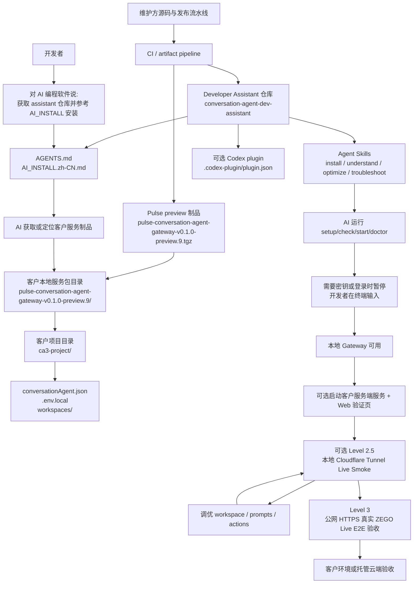

# Conversation Agent Developer Assistant

Conversation Agent Developer Assistant 是面向 AI 编程软件的开发者辅助仓库，用于帮助开发者安装、理解、配置、调优和排障 Conversation Agent Service。

它不是 Conversation Agent Service runtime，也不包含闭源服务源码或客户密钥。客户运行服务时使用客户服务制品；AI 编程软件理解和操作服务时使用本仓库。

## 仓库和制品关系

| 仓库 | 职责 |
| --- | --- |
| `pulse-conversation-agent` | 对外 preview 仓库，包含文档、示例、契约、workspace、checksum 和 GitHub Release 制品。开发者从它的 Release 页面下载可运行服务包。 |
| `conversation-agent-dev-assistant` | 面向 AI 编程工具的辅助仓库，指导安装、验收、prompt 优化和排障流程。 |

## 开发者路径



## 给 AI 编程软件的启动提示

```text
帮我获取 https://github.com/Cogit-oergo-sum/conversation-agent-dev-assistant，
阅读 AI_INSTALL.zh-CN.md 和 AGENTS.md，
按里面的步骤从 https://github.com/Cogit-oergo-sum/pulse-conversation-agent/releases/tag/v0.1.0-preview.9
安装 Pulse Conversation Agent 0.1.0-preview.9。
遇到 GitHub、ZEGO、LLM、npm registry 等鉴权或密钥输入时，
不要让我在聊天里粘贴密钥，请让我在本地终端自己输入。
完成后运行 check/status/doctor，并说明当前达到哪一级验收。
```

Level 2 通过后，如需本地真实 RTC smoke，可以继续对 AI 编程软件说：

```text
在 Level 2 通过后，使用 examples/local-cloudflare-live-e2e 跑一次本地 tunnel Live Smoke。
如果 Web 前端已经部署在另一台机器，请用 --web-url 指向它，并不要启动内置 Web。
需要密钥或 cloudflared 登录时，让我在终端输入，不要让我把密钥发到聊天里。
如果 Quick Tunnel 断链，请确认 keeper 已刷新 Gateway / 客户服务端 public URL 并重新注册 ZEGO Agent。
完成后告诉我达到 Level 2.5 还是仍停留在 Level 2，并声明这不是托管云端或生产验收。
```

## 可用 Skills

| Skill | 用途 |
| --- | --- |
| `conversation-agent-install` | 引导下载或定位客户服务制品，初始化项目，运行 setup/check/start/doctor。 |
| `conversation-agent-understand-service` | 解释 Conversation Agent Service 的边界、配置、客户服务端服务和 Web 示例关系。 |
| `conversation-agent-optimize-prompts` | 调整客户 workspace、mode prompt、knowledge、action contract，并设计验证。 |
| `conversation-agent-scenario-eval` | 在真实 RTC 验证前，运行本地纯文本场景评测，提前发现 prompt、mode、action 和动态上下文风险。 |
| `conversation-agent-troubleshoot-live-e2e` | 排查安装、Gateway、客户服务端服务、Web、ZEGO Live E2E 问题。 |

`skills/` 是标准 Agent Skills 源目录；`.agents/skills/` 是 Codex 仓库自动发现目录；`plugins/codex/skills/` 是 Codex plugin 分发目录。更新 skill 时应保持三处内容一致。

## 验收分级

| 级别 | 含义 | 典型检查 |
| --- | --- | --- |
| Level 1 | 本地 Gateway 可用 | `check`、`status`、Gateway control health；裸 curl 需要按配置携带认证。 |
| Level 2 | 客户服务端服务和 Web 验证页可用 | `/health`、`/config/runtime`、Web 页面可打开。 |
| Level 2.5 | 本地 Cloudflare Tunnel 真实 RTC/ZEGO callback smoke | Tunnel URL、入房、麦克风发布、AgentInstance、ASR、LLM callback、TTS、字幕、mode/status/perf、主动说话、Action UI/feedback，以及范围内的多 workspace 路由；不能替代发布验收。 |
| Level 3 | 真实 ZEGO Live E2E 可用 | 从已发布制品部署到公网 HTTPS；入房、麦克风发布、AgentInstance 创建、ASR、LLM callback、TTS、字幕、mode/action/status、主动说话、action feedback，以及范围内的多 workspace 隔离。 |

## Level 2.5 到 Level 3 的迁移关系

| Level 2.5 本地 tunnel | Level 3 云端 |
| --- | --- |
| Cloudflare tunnel URL | 客户云端域名 / 公网 HTTPS 域名 |
| local router routes | nginx / LB 路由规则 |
| 本机 Gateway / 客户服务端服务 / Web | 云端进程、容器或多机器服务 |
| `--web-url` 指向远端 Web 预览 | 独立 Web 静态站点、CDN 或前端服务器 |
| `.env.local` / 客户服务端服务 `.env` | 云端 secret store、KMS、CI/CD secret、容器 secret |
| 前台脚本 | systemd / supervisor / container orchestration |
| Level 2.5 smoke evidence | Level 3 Live E2E 托管云端或客户环境证据 |

如果发布声明包含多 workspace 支持，Level 2.5 和 Level 3 都必须覆盖 default、action-validation、isolation-validation 三类 workspace。单 workspace Live E2E 不能算该发布范围下的完整 Level 3。

## 安全默认值

- 不要在聊天中粘贴 LLM API Key、ZEGO ServerSecret、control token、callback token、GitHub token 或 npm token。
- 密钥只应写入客户项目 `.env.local` 或客户服务端服务示例 `.env`。
- `conversationAgent.json` 应只保存 `env:NAME` 或等价引用。
- 不要提交 `.env*`、运行日志、状态文件、客户数据或截图中的密钥。
- AI 可以运行交互式命令，但鉴权和密钥输入应由开发者在本地终端完成。

## Codex 使用方式

Codex 在本仓库内运行时会通过 `.agents/skills/` 自动发现 skills。如果需要以插件形式安装，使用 `plugins/codex/` 作为插件根目录。

```bash
codex plugin marketplace add ./conversation-agent-dev-assistant/plugins
```

插件发布前请确认 `plugins/codex/skills/` 与根目录 `skills/` 内容一致。
